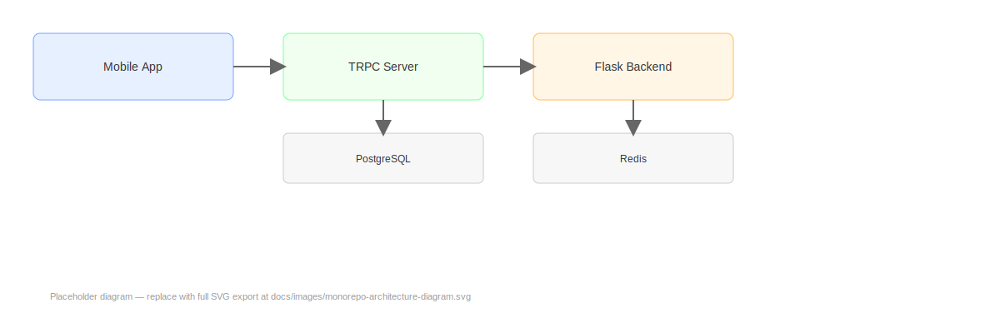

# Monorepo Architecture Diagram — Financial Powerhouse Platform
### (PlaidBridgeOpenBankingApi — Backend API & Unified Monorepo)

This file is the canonical location for the monorepo architecture diagram and a short accompanying explanation. Store a visual export (SVG/PNG) in docs/images/ and reference it below so the documentation renders a clear diagram for engineers and operators.

---

**Technical Identity:** `PlaidBridgeOpenBankingApi`  
**Platform Identity:** Financial Powerhouse Platform

---

## Purpose
Provide a single visual representation of the monorepo structure and runtime/service boundaries (backend services, mobile app, shared TRPC server, DB, Redis, CI/CD). The diagram should be kept up-to-date with architectural changes and stored in the repo so it is versioned alongside the docs.

---

## Recommended Diagram Contents
- Top-level repo layout (packages/services/apps)
- Runtime components and communication flows:
  - Mobile App (Expo / TRPC client)
  - TRPC Shared Server
  - Flask Backend (API, Services, Workers)
  - PostgreSQL
  - Redis (rate limiting, telemetry, job queue)
  - External integrations (Plaid, Treasury Prime)
  - CI/CD (GitHub Actions) and docs hosting
- Important arrows: network flows, async job queues, event traces
- Label ingress points, authentication boundaries, and operator touchpoints (health endpoints, dashboards).

---

## Image & File Guidelines
- Place the visual diagram at: `docs/images/monorepo-architecture-diagram.svg`
  - Prefer SVG for crisp rendering in mkdocs; include a PNG fallback if needed.
- Keep file size reasonable (optimize SVG) and ensure text is readable at common viewport sizes.
- If using generated exports from diagram tools, include the source file in a non-public area or a separate design repo; if acceptable, include a lightweight editable source (draw.io .drawio or .svg source).

Example embed (Markdown):
```markdown


